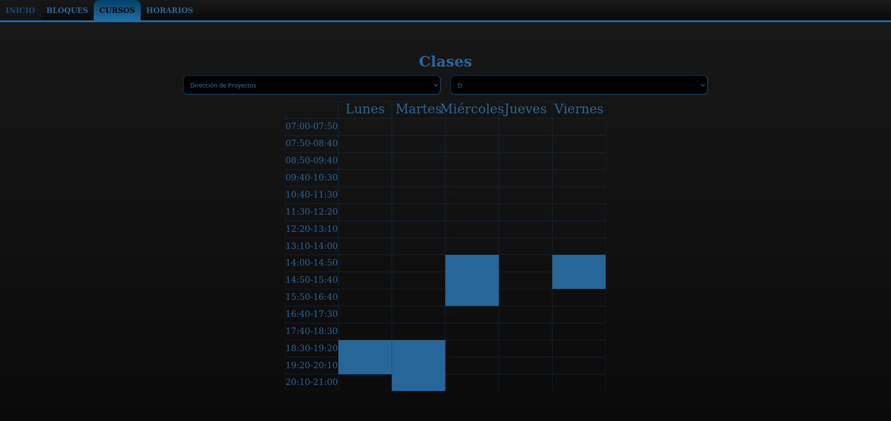

# Schedule-React-JS
> English not my first language

Simple React JS app that creates an schedule\* for you.

##### \* Restricted to the hours especified by my university

## Table of contents
- [Introduction](#introduction)
- [Technologies](#technologies)
- [Illustrations](#illustrations)
- [To-Do](#to-do)

## Introduction
This project is a practice for introduction to SASS/SCSS and getting it to work alongside JSX. It's a simple website to automatize the creation of schedules for the next semester, while also using localStorage to keep that data stored.

## Technologies
- NodeJS v15.8.0

## Illustrations

| Tutorial | Create Blocks |
|:---:|:---:|
|||

| Courses | Schedules |
|:---:|:---:|
|| *Not Finished Yet* |

## To-Do
- Complete schedules' visualization
- Add way to remove blocks